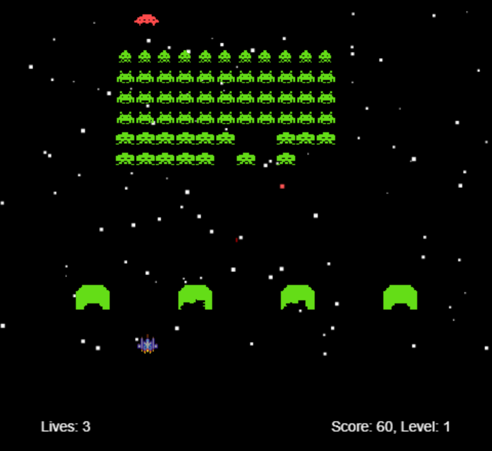

<div align="center">

&nbsp;&nbsp;&nbsp;&nbsp;&nbsp;&nbsp;

# Invaders

**The arcade classic, in plain JavaScript. Clear the sky and they come back faster.**

<a href="https://azadmotala.github.io/invaders/"></a>


[](https://github.com/azadmotala/invaders/releases)
[](LICENSE)

<a href="https://azadmotala.github.io/invaders/"></a>

[How to play](#how-to-play) · [Run it locally](#run-it-locally) · [Tweak it](#tweak-it) · [What's new](https://github.com/azadmotala/invaders/releases) · [Credits](#credits) · [License](#license)

</div>

## The game

The fleet marches side to side, drops a row every time it hits the edge, and bombs you on the way down. Shoot every last one and the next wave turns up faster, bigger and quicker to bomb. Let them reach the bottom and it's over.

The fleet lines up like the 1978 arcade game: squids along the top, crabs in the middle and octopuses in the bottom two rows, all marching in two poses. They come in their original green. Switch on random colours and every wave turns up in a different colour from the last.

## How to play

Play it in your browser at **[azadmotala.github.io/invaders](https://azadmotala.github.io/invaders/)**. Nothing to install. On a phone or tablet, the game fills the screen and you steer with your thumb.

| | Computer | Phone or tablet |
|---|---|---|
| Start / play again | <kbd>Space</kbd> | Tap |
| Move | <kbd>←</kbd> <kbd>→</kbd> | Drag anywhere on the screen |
| Fire | <kbd>Space</kbd> (hold it down to keep firing) | Keep your finger down |
| Pause | <kbd>P</kbd> or the **Pause** button | **Pause** button, or switch to another app |
| Sound on/off | **Mute** button | **Mute** button |
| Invader colours | **Random colours** button | **Random colours** button |

On a computer the buttons sit under the game. On a phone or tablet they're in the top corner.

### Rules

- You get three lives. Each bomb that hits your ship costs one.
- If an invader reaches the bottom or crashes into your ship, the game ends right there.
- Squids are worth 30 points, crabs 20 and octopuses 10, the same as the arcade game. Clear a wave and you get a bonus of 50 × that level.

### It gets harder

Every level, the invaders move faster, drop bombs more often, and the bombs fall faster. The fleet gets bigger too. You get a faster trigger finger to keep up.

The fleet and your fire rate stop growing at level 25. The invaders' speed doesn't.

Within each wave, the fleet speeds up as you thin it out, like the arcade game. It's gentle at first: with half the invaders left they're about 1.4 times as fast, and with a quarter left twice as fast. The last few move five times as fast as the full fleet did.

## Run it locally

Use a local web server. You can open `index.html` straight from disk, but your browser won't load the sound effects that way, so you'd be playing in silence.

With [Node.js](https://nodejs.org):

```bash
git clone https://github.com/azadmotala/invaders.git
cd invaders
npm install
npm run dev
```

Then open http://localhost:3000.

No Node? Any static server works. From the project folder, with Python:

```bash
python -m http.server 8000
```

Then open http://localhost:8000.

To put it online, upload the folder as it is to any static host, such as GitHub Pages or Netlify. There's nothing to build. `npm run build` also makes a ready-to-upload copy in `dist/`, without the README and project files.

## Tweak it

All the tuning sits in the `config` object at the top of [`js/spaceinvaders.js`](js/spaceinvaders.js). The fleet, bomb and fire-rate numbers are base values that grow with each level.

| Setting | Default | What it changes |
|---|---|---|
| `invaderInitialVelocity` | `25` | How fast the fleet moves |
| `bombRate` | `0.05` | How often the front row drops bombs |
| `invaderRanks` / `invaderFiles` | `5` / `10` | Rows and columns in the fleet |
| `shipSpeed` | `120` | How fast your ship moves |
| `rocketMaxFireRate` | `2` | Shots per second |
| `levelDifficultyMultiplier` | `0.2` | How much harder each level gets |
| `invaderSpeedUpMax` | `5` | How much faster the last invaders in a wave get (`1` turns the speed-up off) |

The invaders are drawn in code. `INVADER_TYPES`, near the top of the same file, holds each kind's pixel grids for its two poses and how many points it's worth. Edit a grid to redraw an invader, or add colours to `INVADER_COLOURS`.

Add `?debug=true` to the URL and the game outlines the play area.

## Project layout

```
invaders/
├── index.html            Page, canvas, input handling and touch-screen layout
├── js/
│   ├── spaceinvaders.js  Game loop, states, ship, invaders and sound
│   └── starfield.js      Scrolling star background
├── css/                  Page styles
├── images/               Ship sprite, and invader pictures for the README
├── sounds/               Sound effects
├── docs/                 Screenshot
└── vite.config.js        Settings for npm run build
```

## Credits

Invaders is based on [spaceinvaders](https://github.com/dwmkerr/spaceinvaders) by Dave Kerr, which supplies the game engine, the starfield and the core gameplay. This version adds a pixel-art ship, the arcade game's three kinds of invader drawn in code with their marching poses and points, an option to give every wave a new colour, Pause and Mute buttons, and touch controls for phones and tablets.

## License

[MIT](LICENSE). The original spaceinvaders code is also MIT, and its copyright notice is kept in the LICENSE file.
